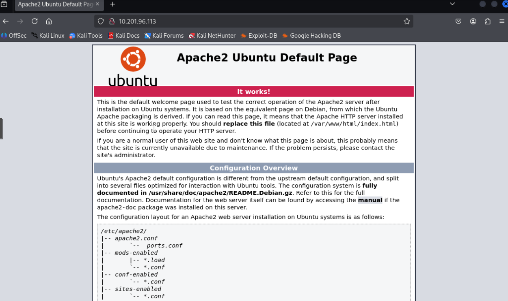

# TryHackMe Simple CTF write-up

The Simple CTF challenge on the TryHackMe platform is designed for beginners to learn how to scan, enummerate, research, exploit, and utilize privelage escalation. Enjoy!

Target IP: 10.201.96.113

## 1. Recon

### Rustscan

The first thing I do on every room is perform a scan for any open ports I could use to my advantage.

Most folks use the nmap tool, which is still a good tool, however I personally use Rustscan since it scans ports more efficiently than nmap does. Both tools can work for this challenge. Below is a a screenshot of the rustscan tool I used.


From the results, we can see that the following ports are open...

- 21 (ftp)
- 80 (http)
- 2222 (ssh)

**Q1: How many services are running under port 1000?**

- *Answer: 2*
- Port 21 (ftp) and port 80 (http) are two services that have ports under 1000*

**Q2: What is running on the higher port?**

- *Answer: SSH*

Knowing that this is a website being hosted, lets visit it to see if it gives us anything.



Looks like the defauly Apache2 page, nothing to go off here.

The next thing we will try is using gobuster to see if there are any additional pages on the website.

```
gobuster dir -u http://10.201.96.113:80 -w /usr/share/wordlists/dirbuster/directory-list-2.3-medium.txt -t 100
```


It appears we hit two pages on the website using the medium wordlist.

- /simple
- /server-status

Lets see what http:10.201.96.113/simple has.


Scrolling to the bottom of the page, we can see that the version is 2.2.8. 


Let’s see if there is anything online about this particular version by simply going to Google and searching “CMS Made Simple 2.2.8 exploit”.

In our results, we see a page on Exploit-DB that matches our search and refers to a SQL injection attack utilizing CVE-2019–9053.


**Q3: What's the CVE you're using against the application?**

- *Answer: CVE-2019–9053*

**Q4: To what kind of vulnerability is the application vulnerable?**

- *Answer: SQLi*


